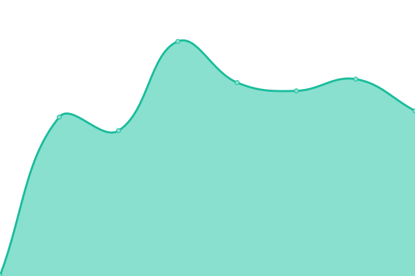

# [📈 Live Status](https://upptime.github.io/upptime): <!--live status--> **🟩 All systems operational**

This repository contains the open-source uptime monitor and status page for [Upptime](https://upptime.js.org), powered by [Upptime](https://github.com/upptime/upptime).

With [Upptime](https://upptime.js.org), you can get your own unlimited and free uptime monitor and status page, powered entirely by a GitHub repository. We use [Issues](https://github.com/upptime/upptime/issues) as incident reports, [Actions](https://github.com/Dodger77/upptime/actions) as uptime monitors, and [Pages](https://upptime.github.io/upptime) for the status page.

<!--start: status pages-->
<!-- This summary is generated by Upptime (https://github.com/upptime/upptime) -->
<!-- Do not edit this manually, your changes will be overwritten -->
<!-- prettier-ignore -->
| URL | Status | History | Response Time | Uptime |
| --- | ------ | ------- | ------------- | ------ |
|  [Ceresana](https://www.ceresana.com) | 🟩 Up | [ceresana.yml](https://github.com/Dodger77/upptime/commits/HEAD/history/ceresana.yml) | 

 1064ms
     
 | 

<a href="https://Dodger77.github.io/upptime/history/ceresana">100.00%</a>
    

|  [Siriderma-Shop](https://shop.siriderma.de) | 🟩 Up | [siriderma-shop.yml](https://github.com/Dodger77/upptime/commits/HEAD/history/siriderma-shop.yml) | 

 2685ms
     
 | 

<a href="https://Dodger77.github.io/upptime/history/siriderma-shop">99.80%</a>
    

|  [Siriderma](https://www.siriderma.de) | 🟩 Up | [siriderma.yml](https://github.com/Dodger77/upptime/commits/HEAD/history/siriderma.yml) | 

 2023ms
     
 | 

<a href="https://Dodger77.github.io/upptime/history/siriderma">99.56%</a>
    

|  [Apodeko](https://www.apodeko.de) | 🟩 Up | [apodeko.yml](https://github.com/Dodger77/upptime/commits/HEAD/history/apodeko.yml) | 

 915ms
     
 | 

<a href="https://Dodger77.github.io/upptime/history/apodeko">100.00%</a>
    

|  [Holzfinis](https://www.holzfinis.de) | 🟩 Up | [holzfinis.yml](https://github.com/Dodger77/upptime/commits/HEAD/history/holzfinis.yml) | 

 1121ms
     
 | 

<a href="https://Dodger77.github.io/upptime/history/holzfinis">100.00%</a>
    

|  [vpAgentur](https://www.vp-agentur.de) | 🟩 Up | [vp-agentur.yml](https://github.com/Dodger77/upptime/commits/HEAD/history/vp-agentur.yml) | 

 691ms
     
 | 

<a href="https://Dodger77.github.io/upptime/history/vp-agentur">100.00%</a>
    

|  [Fantasy Heaven](https://www.fantasy-heaven.de) | 🟩 Up | [fantasy-heaven.yml](https://github.com/Dodger77/upptime/commits/HEAD/history/fantasy-heaven.yml) | 

 851ms
     
 | 

<a href="https://Dodger77.github.io/upptime/history/fantasy-heaven">100.00%</a>
    

<!--end: status pages-->

[**Visit our status website →**](https://dodger77.github.io/upptime)

## 📄 License

- Code: [MIT](./LICENSE) © [Upptime](https://upptime.js.org)
- Data in the `./history` directory: [Open Database License](https://opendatacommons.org/licenses/odbl/1-0/)
